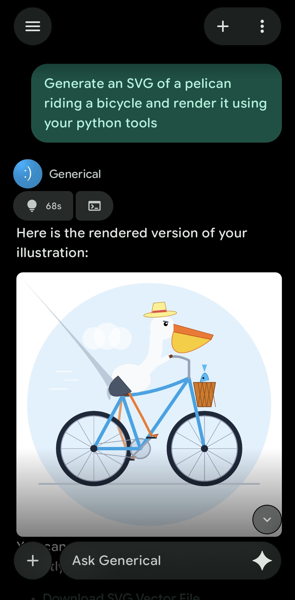
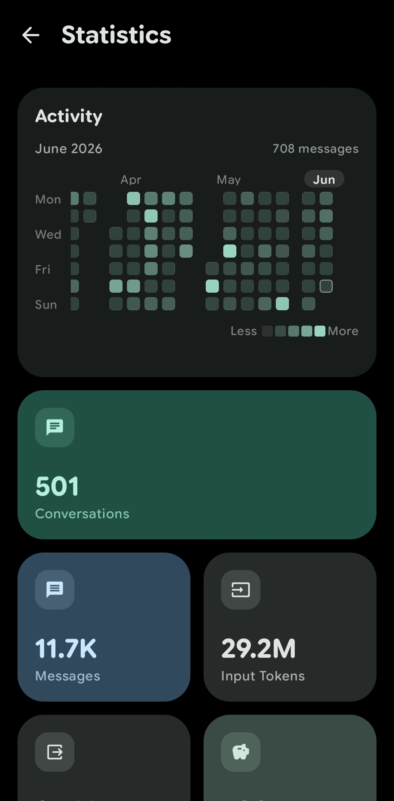

# LastChat

  
    
   
    

**LastChat** is a feature-rich AI assistant application for Android. It is a fork of [RikkaHub](https://github.com/re-ovo/RikkaHub), modified using AI agents

This project aims to provide a privacy-focused and highly personalized AI chat experience on Android

## Gallery

<table align="center" style="border: none;">
  <tr>
    <td align="center" style="border: none; width: 50%;">
      
    </td>
    <td align="center" style="border: none; width: 50%;">
      
    </td>
  </tr>
  <tr>
    <td align="center" style="border: none; width: 50%;">
      
    </td>
    <td align="center" style="border: none; width: 50%;">
      
    </td>
  </tr>
</table>

## ✨ Key Features

### Advanced AI Capabilities
* **Multi-Provider Support**: Provider presets make it easier to get up and running. There's support for custom providers too!
* **RAG Memory**: Features a RAG-based memory system. Assistants can "remember" details from past conversations using embeddings.
* **Multi-Modal Inputs**: Interact using Text, Images, Video, and Audio.

### Tools & Integrations
* **Python**: Built-in Python Engine, powered by Workspaces/PRoot-based Linux environments.
* **JavaScript**: Built-in **JavaScript Engine** (QuickJS)
* **Web Search**: Integrated web search capabilities to fetch real-time information.
* **MCP**: Support for MCP servers.

### Assistant Management
* **Multiple Personas**: Create, manage, and switch between unlimited custom assistants.
* **Tagging System**: Organize assistants with custom tags.
* **Import/Export**: Easily share or backup your assistant configurations.

### Modern & Fluid UI
* **Material You**: The app was designed with Material You 3 Expressive in mind.
* **Rich Rendering**: Markdown support with LaTeX for math, code highlighting, and tables.

### Additional Modules
* **Image Generation**: Dedicated interface for generating images using supported models.
* **Text-to-Speech (TTS)**: Supports system TTS or other providers.

### Privacy & Data
* **Local-First**: Chat history and vector memory are stored locally on your device.
* **WebDAV Backup**: Securely sync and backup your data to any WebDAV-compatible server.

## Built With
* **Kotlin** & **Jetpack Compose**
* **Koin** for Dependency Injection
* **Room** & **DataStore** for persistence
* **WorkManager** & **AlarmManager** for reliable background tasks
* **QuickJS** for JavaScript integration

## Credits
* Original Project: [RikkaHub](https://github.com/re-ovo/RikkaHub)
* Image cropper is an edited version of the image editor found in [LavenderPhotos](https://github.com/kaii-lb/LavenderPhotos)
* Made with **AI Agents** based on:
    * **Claude**
    * **Codex**
    * **Antigravity**

##

<a href="https://www.star-history.com/?repos=Cocolalilal%2FLastChat&type=date&legend=bottom-right">
 <picture>
   <source media="(prefers-color-scheme: dark)" srcset="https://api.star-history.com/chart?repos=Cocolalilal/LastChat&type=date&theme=dark&legend=top-left" />
   <source media="(prefers-color-scheme: light)" srcset="https://api.star-history.com/chart?repos=Cocolalilal/LastChat&type=date&legend=top-left" />
   
 </picture>
</a>

##
*Note: This project is a fork and may contain modifications or features not present in the original RikkaHub repository.*
