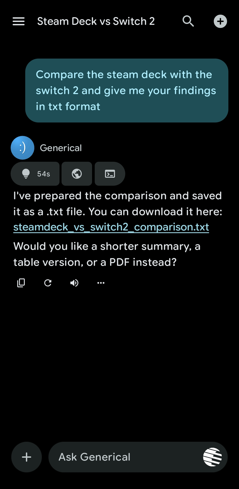
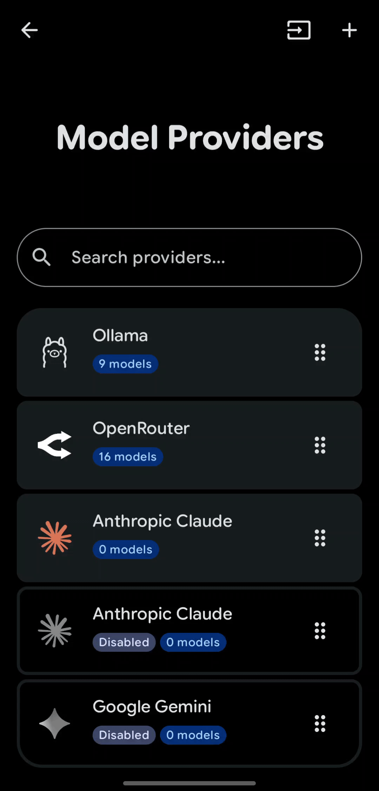
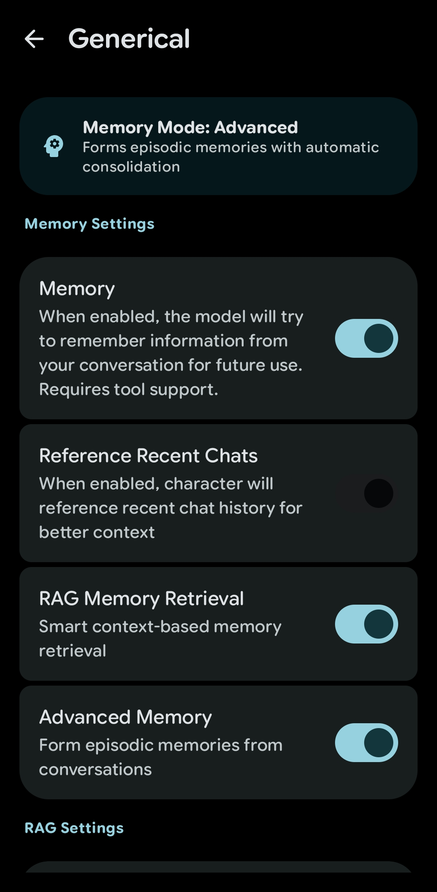

# LastChat

  

**LastChat** is a feature-rich AI assistant application for Android. It is a fork of [RikkaHub](https://github.com/re-ovo/RikkaHub), modified using **Claude 4.5 Opus**, **GPT Codex** and **Gemini 3 Pro**

This project aims to provide a privacy-focused and highly personalized AI chat experience on Android

## Gallery

<table align="center" style="border: none;">
  <tr>
    <td align="center" style="border: none; width: 50%;">
      
    </td>
    <td align="center" style="border: none; width: 50%;">
      
    </td>
  </tr>
  <tr>
    <td align="center" style="border: none; width: 50%;">
      
    </td>
    <td align="center" style="border: none; width: 50%;">
      
    </td>
  </tr>
</table>

## ✨ Key Features

### Advanced AI Capabilities
*   **Multi-Provider Support**: Provider presets make it easier to get up and running. There's support for custom providers too!
*   **RAG Memory**: Features a sophisticated **Vector-Based Long-Term Memory** system. Assistants can "remember" details from past conversations using embeddings.
*   **Multi-Modal Inputs**: Interact using Text, Images, Video, and Audio.

### Tools & Integrations
*   **Python**: Built-in **Python Engine** (Chaquopy)
*   **JavaScript**: Built-in **JavaScript Engine** (QuickJS)
*   **Local Device Control**: The AI can interact with your device if you want:
    *   Send notifications
    *   Launch apps
    *   Read notifications
    *   Set alarms/reminders
*   **Web Search**: Integrated web search capabilities to fetch real-time information.
*   **MCP**: Support for MCP servers.

### Assistant Management
*   **Multiple Personas**: Create, manage, and switch between unlimited custom assistants.
*   **Tagging System**: Organize assistants with custom tags.
*   **Import/Export**: Easily share or backup your assistant configurations.
*   **Global Settings**: Centralized management for memory consolidation and background behaviors.

### Modern & Fluid UI
*   **Material You**: The app was designed with Material You 3 Expressive in mind.
*   **Rich Rendering**: Markdown support with LaTeX for math, code highlighting, and tables.

### Additional Modules
*   **Image Generation**: Dedicated interface for generating images using supported models.
*   **Translator**: A specialized mode for text translation.
*   **Text-to-Speech (TTS)**: Supports system TTS or other providers.

### Privacy & Data
*   **Local-First**: Chat history and vector memory are stored locally on your device.
*   **WebDAV Backup**: Securely sync and backup your data to any WebDAV-compatible server.

## iOS Porting Roadmap

A detailed AI-agent-oriented unification plan is available at [`docs/ios-unification-agent-plan.md`](docs/ios-unification-agent-plan.md), with an execution checklist in [`docs/ios-unification-agent-checklist.yaml`](docs/ios-unification-agent-checklist.yaml).

## Built With
*   **Kotlin** & **Jetpack Compose**
*   **Koin** for Dependency Injection
*   **Room** & **DataStore** for persistence
*   **WorkManager** & **AlarmManager** for reliable background tasks
*   **Chaquopy** for Python integration
*   **QuickJS** for JavaScript integration

## Credits
*   Original Project: [RikkaHub](https://github.com/re-ovo/RikkaHub)
*   About page is inspired by [PixelPlayer](https://github.com/theovilardo/PixelPlayer)
*   Image cropper is an edited version of the image editor found in [LavenderPhotos](https://github.com/kaii-lb/LavenderPhotos)
*   Made with **AI Agents** based on:
    *   **Claude 4.5 Opus**
    *   **GPT Codex**
    *   **Gemini 3 Pro**

---
*Note: This project is a fork and may contain modifications or features not present in the original RikkaHub repository.*
